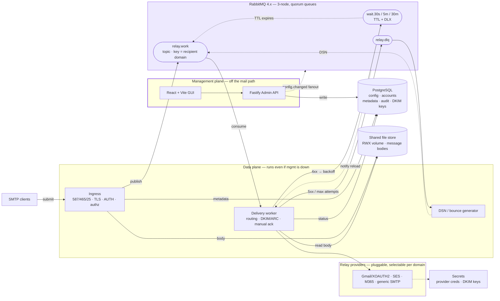

# Cloud-Native SMTP Relay — Engineering Handover Spec

> Working title; project name TBD. This document is the build contract for the AI coder.
> Status: architecture settled, v1 scope defined. Direct-to-MX delivery is **out of scope** (see Non-Goals).

---

## 1. Overview

A cloud-native, horizontally-scalable **SMTP relay** with a management GUI. Clients submit mail to the relay; the relay authorizes, queues, signs, and forwards each message through a pluggable, authenticated **upstream provider** (Gmail/Workspace, Amazon SES, Microsoft 365, generic SMTP smarthost). The relay never delivers directly to recipient MX servers.

It deploys identically on **Kubernetes, Docker, and bare metal**, is configured entirely through a web GUI backed by a single Postgres source of truth, and keeps relaying mail even when the management plane is offline.

### Goals
- Highly available, scalable relay; in-flight mail survives any single service or node failure.
- All operational config set via GUI → Postgres → read by every service, with **live hot reload** (no restarts).
- Pluggable relay providers: enable/disable individually, select per sender-domain and/or recipient-domain, with failover chains.
- Full modern outbound email-auth: DKIM signing, ARC sealing (for forwarded mail), SPF/DMARC awareness.
- Three deploy targets from one set of artifacts.

### Non-Goals (v1)
- **No direct-to-MX delivery.** Every message exits via an authenticated upstream provider. (This removes IP-reputation/warm-up, PTR/rDNS, port-25 egress, and MTA-STS/DANE *enforcement-as-sender* concerns entirely.)
- No inbound mailbox storage / IMAP. This is a relay, not a mailbox server.
- Multi-tenancy/RBAC, audit-replay tooling, and inbound-auth verification are **v2** (listed in §13).

---

## 2. Architecture



**Two planes, fully decoupled.** The *management plane* (GUI + Admin API) only reads/writes config in Postgres and emits change notifications; it is never on the mail path. The *data plane* (ingress + delivery workers + DSN generator) does all mail handling and keeps running if the management plane — or a brief Postgres blip — is down, because each service caches config locally.

---

## 3. Tech Stack

| Layer | Choice | Notes |
|---|---|---|
| Data-plane services | **Go** | `emersion/go-smtp` (server + client), `emersion/go-sasl` (PLAIN/LOGIN/XOAUTH2), `emersion/go-msgauth` (DKIM/ARC) |
| Message bus | **RabbitMQ 4.x** | Quorum queues only; classic mirroring is removed in 4.x. Go client: `rabbitmq/amqp091-go` |
| Config / metadata store | **PostgreSQL** | Single source of truth. Go: `pgx`. No SQLite path |
| Message-body store | **Shared filesystem** (ReadWriteMany volume) | Bodies written as files keyed by message id; bus and Postgres carry references only. **No object store / S3 dependency.** Must be RWX (shared) because ingress writes and a separate delivery pod reads — on kw this is Longhorn RWX or an NFS mount. Interface-backed (`internal/store`) so a Postgres-`bytea` fallback covers tiny/single-node deployments |
| Admin API | **Fastify (Node + TypeScript)** | Talks to Postgres; publishes config-change notifications to RabbitMQ; never touches the mail path |
| GUI | **React + Vite (TypeScript)** | Its own service/image; **never** embedded into a Go binary |
| Secrets | k8s Secret / env / file | Provider creds + DKIM private keys envelope-encrypted at rest |
| TLS for cert mgmt | cert-manager + ACME | The **only** sanctioned CRD usage (see §8) |
| Packaging | Helm, docker-compose, systemd | Multi-arch distroless images |
| Observability | Prometheus, slog, health probes | §11 |

License: **open source** (pick at repo init; permissive recommended given the dependency set).

---

## 4. Repository Layout (monorepo)

```
/cmd
  ingress/            # Go binary — SMTP listener + authz + enqueue
  delivery/           # Go binary — consume, route, sign, relay, ack
  dsn/                # Go binary — DLQ consumer → bounce/DSN generation
/internal             # shared Go packages
  smtp/  routing/  providers/  dkim/  amqp/  config/  store/  authz/  model/
/services
  admin-api/          # Fastify + TypeScript
/web                  # React + Vite app (separate build + image)
/api                  # SHARED CONTRACTS: job schema, config-event schema, config DTOs
/deploy
  helm/  docker-compose/  systemd/
/migrations           # SQL migrations (golang-migrate or sqlc-compatible)
Taskfile.yml          # build/test/lint per service
```

The data-plane binaries have **zero** knowledge of the GUI. Go and Fastify communicate only through (a) the shared Postgres schema and (b) the versioned schemas in `/api`.

---

## 5. Components

**Ingress (`cmd/ingress`)** — Listens on 587 (submission, STARTTLS), 465 (implicit TLS), optionally 25. Performs TLS termination, SMTP AUTH, and inbound authorization (who may relay, which sender/relay domains are permitted). On accept: writes the raw RFC822 body to the shared file store, writes message metadata to Postgres, and publishes a lightweight **job** to `relay.work`. Stateless; scale horizontally.

**Delivery worker (`cmd/delivery`)** — Consumes `relay.work` with **manual acks**. Resolves the route (which provider), fetches the body by reference, applies DKIM signing (+ ARC if forwarding), and hands off to the selected upstream provider. Acks only after a successful upstream handoff. Translates upstream responses into ack / backoff / dead-letter (see §6). Scale horizontally.

**DSN generator (`cmd/dsn`)** — Consumes `relay.dlq`, builds RFC 3464 delivery-status notifications, and publishes them back through `relay.work` for delivery to the original sender.

**Admin API (`services/admin-api`)** — Fastify REST/JSON over the Postgres config schema. Validates writes, then publishes a `config.changed` event to the RabbitMQ fanout. The GUI is its only client; everything is API-driven so it is fully automatable.

**GUI (`web`)** — React + Vite SPA, served as its own service. Configures relay rules, providers, domains, credentials, accounts, and surfaces message logs/delivery status.

---

## 6. Message Bus Topology (RabbitMQ 4.x)

All queues are **quorum queues** on a **3-node cluster** (quorum requires a majority; three nodes is the minimum for fault tolerance).

- **`relay.work`** — topic exchange; routing key = **recipient domain**. Lets a slow/throttled domain get its own bound queue so it never head-of-line-blocks others. Per-domain rate limits enforced in the delivery worker (consumer prefetch/QoS + token budget).
- **Retry tiers** — on a transient failure (greylist, upstream 4xx) the worker `reject`s (no requeue); the message dead-letters into a **wait queue** (`wait.30s`, `wait.5m`, `wait.30m`, …) that has a message **TTL** and a DLX pointing back at `relay.work`. When the TTL expires, the message re-enters delivery. Pure core AMQP — no plugins. (The `delayed-message-exchange` plugin is an optional alternative for arbitrary delays; not required.)
- **`relay.dlq`** — permanent failures (upstream 5xx / max attempts exhausted) dead-letter here; the DSN generator consumes it.
- **Failover semantics** — a worker that dies mid-delivery leaves its message unacked; RabbitMQ redelivers it to another consumer automatically. This is the "service goes down, another picks up" guarantee, per message, no offset bookkeeping.
- **Config fanout** — a separate fanout exchange carries `config.changed`; each service binds an exclusive auto-delete queue and, on notification, re-reads the affected config slice from Postgres (§8).

**The bus carries references, not blobs.** Multi-MB bodies live only in the shared file store; jobs and events stay small.

---

## 7. Provider Model & Routing

```
type Provider interface {
    Send(ctx, *Message) (Result, error)   // Result: Delivered | Defer(4xx) | Fail(5xx)
    Capabilities() ProviderCaps            // auth model, max size, supported features
    Name() string
}
```

**Built-in relay providers (all toggleable):**
- **Gmail / Google Workspace** — `smtp-relay.gmail.com` (IP-auth or SMTP-AUTH, Workspace, ~10k recipients/day) or `smtp.gmail.com` with **XOAUTH2** + automatic token refresh (Google OAuth tokens expire ~1h; refresh proactively). Raw-password auth is dead; support app-password and OAuth2 only.
- **Amazon SES** — SMTP interface, IAM-derived SMTP creds.
- **Microsoft 365** — high-volume email / SMTP relay endpoints.
- **Generic SMTP smarthost** — host/port/auth/TLS configurable; covers everything else.

**Routing engine precedence** (resolved per message):
1. Recipient-domain rule → 2. Sender-domain rule → 3. Default provider.
Each rule can be independently enabled/disabled and can define a **failover chain** (e.g., SES → generic smarthost). A `Defer`/`Fail` from one provider can advance the chain before falling back to the retry tiers.

---

## 8. Configuration Model

**Two tiers, deliberately separated:**
- **Bootstrap config** (env/flags only): Postgres DSN, RabbitMQ URL, listen addresses, TLS bootstrap, body-store mount path (the RWX volume). Just enough to start and reach the DB/bus.
- **Operational config** (Postgres, GUI-edited only): providers, credentials (encrypted), relay rules, permitted domains, accounts, DKIM selectors/keys, rate limits, TLS policy.

**Source of truth = Postgres.** No application config in CRDs, ConfigMaps, or files. The **only** CRDs in play are cert-manager's (ACME/TLS) and standard service discovery — nothing app-specific.

**Hot reload:** each service loads operational config at boot and **caches it locally**, then subscribes to the `config.changed` fanout. The Admin API publishes that event after a successful write; services reload only the affected slice, live. Because config is cached, the data plane survives the GUI, the Admin API, and short Postgres outages — satisfying the "data plane independent of management plane" requirement.

---

## 9. Data Model (Postgres) — initial sketch

| Table | Purpose |
|---|---|
| `accounts` | Relay clients: credentials (hashed), allowed sender domains, IP/CIDR allowlist |
| `relay_domains` | Permitted sender/relay domains |
| `providers` | Provider instances: type, endpoint, auth mode, enabled flag, secret ref |
| `routing_rules` | Recipient/sender-domain → provider(+failover), priority, enabled flag |
| `dkim_keys` | Per-domain selectors, public/private key refs, rotation state |
| `messages` | Per-message metadata: ids, envelope, body ref, status, attempts, timestamps |
| `message_events` | Per-attempt log (queued/relayed/deferred/bounced) for the tracing UI |
| `audit_log` | Who changed what config, when (append-only) |
| `tls_policy` | Min version, STARTTLS-required flags, per-provider overrides |

The **work queue is in RabbitMQ, not Postgres.** Postgres holds config, message metadata, and audit only.

---

## 10. Security

**Inbound (clients → relay):** SMTP AUTH (PLAIN/LOGIN) **only over TLS**; IP/CIDR allowlists; optional mTLS. STARTTLS on 587, implicit TLS on 465, min TLS 1.2 (prefer 1.3).

**Outbound (relay → upstream):** STARTTLS/implicit TLS to the known, authenticated provider endpoints (no MTA-STS/DANE enforcement burden, since we never talk to arbitrary MX). XOAUTH2 token refresh for Google.

**Message authentication:** DKIM signing per sending domain (multiple selectors, rotation). **ARC sealing** for forwarded mail (forwarding breaks SPF/DKIM alignment otherwise). SPF/DMARC awareness for policy/reporting.

**Secrets:** provider credentials and DKIM private keys are envelope-encrypted at rest with a key sourced from env/k8s Secret; never stored plaintext in Postgres; never logged.

---

## 11. Cross-Language Contracts (`/api`)

Because producers (Go ingress) and consumers (Go delivery) and the config publisher (Fastify) span two languages, pin these as **versioned schemas** (JSON Schema or protobuf) from day one:
- **Relay job** — published by ingress to `relay.work` (message id, envelope, body ref, routing hints, attempt count).
- **`config.changed` event** — published by Admin API (what changed, version/epoch).
- **Config DTOs** — the shape the GUI/API read and write.

Treat `/api` as the integration boundary; version it and never break it silently.

---

## 12. Observability & Ops

- **Metrics:** Prometheus `/metrics` on every service (accepted/relayed/deferred/bounced, queue depth, per-provider latency/error rates).
- **Health:** `/healthz` (liveness) + `/readyz` (readiness — DB/bus reachable).
- **Logging:** structured (`slog`), correlation by message id.
- **Message tracing UI:** search by sender/recipient, see queued → relayed → deferred → bounced timeline (backed by `message_events`).

---

## 13. Build Order / Milestones

**M1 — Core relay (single provider).** Ingress (AUTH + TLS), object store + Postgres metadata, RabbitMQ work queue, delivery worker, **generic SMTP provider**, basic DKIM signing. End-to-end relay working.

**M2 — Resilience.** Retry tiers (wait queues + DLX), DLQ + DSN generator, quorum-queue 3-node HA, graceful drain.

**M3 — Providers + routing.** Gmail/XOAUTH2, SES, M365; routing engine with per-domain rules + failover chains; rate limiting.

**M4 — Management plane.** Fastify Admin API, Postgres config schema, `config.changed` hot reload, React+Vite GUI (config + message-tracing).

**M5 — Packaging.** Helm chart, docker-compose, systemd; cert-manager integration; multi-arch images.

**Deferred to v2:** direct-to-MX mode, MTA-STS/DANE enforcement, inbound SPF/DKIM verification, multi-tenancy/RBAC, audit-replay tooling.

---

## 14. Decisions Log

- **Monorepo**, polyglot (Go data plane + Node/TS management + React GUI).
- **GUI is a separate service**; Go binaries never embed it.
- **RabbitMQ 4.x quorum queues** as the bus (chosen for maturity + task-broker fit: per-message ack/redelivery and native DLX/TTL retry, no retry-topic scaffolding).
- **PostgreSQL only** as config/metadata store and single source of truth.
- **Message bodies on a shared filesystem (ReadWriteMany volume), not an object store.** No S3/MinIO dependency. RWX is required because ingress and delivery are separate pods; `internal/store` stays interface-backed with a Postgres-`bytea` fallback for single-node/tiny deployments.
- **No app CRDs**; only cert-manager (ACME) + service discovery.
- **Hot reload** via cached config + `config.changed` fanout.
- **Data plane independent** of management plane.
- **Relay only** — direct-to-MX explicitly out of scope for v1.
